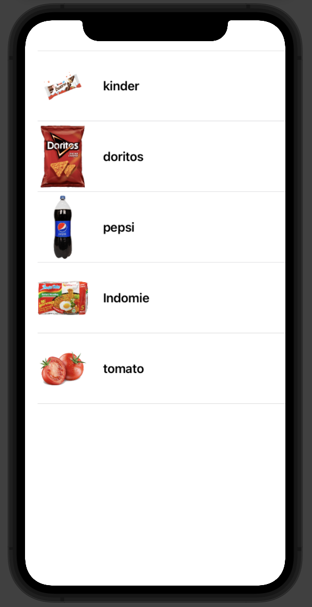

# قائمة List


# <p dir="rtl">
فيديوهات الدرس</p>


 
* [القائمة List](https://youtu.be/rFsv7cqOce8)  

---


# <p dir="rtl">
شرح الدرس</p>


* شلون استعمل القائمة ؟

```
List{
      //Our code           
}
```


<p dir="rtl">
مثال اذا اردنا ان نقوم بانشاء قائمة تحتوي على نص </p>


```
List{
      Text("Buy a kitkat")
      Text("Go To School")
      Text("Do Homework")
}
```


---

## تمرين


1.قم بانشاء تطبيق جديد باسم myGrocery


 
 
2.قم بإضافة اغراض تريد ان تشتريها مع الصورة مثل الشكل التالي، يجب أن تكون داخل مصفوفة.


 
3.استخدم list لعرض المنتجات بهذا الشكل.

`Hint ✨: اسم الصورة المعروضة هو نفسه اسم المنتج`
<p dir="rtl">



</p>


<p dir="rtl">
ملاحظة :الأغراض لا تقل عن ٥</p>

